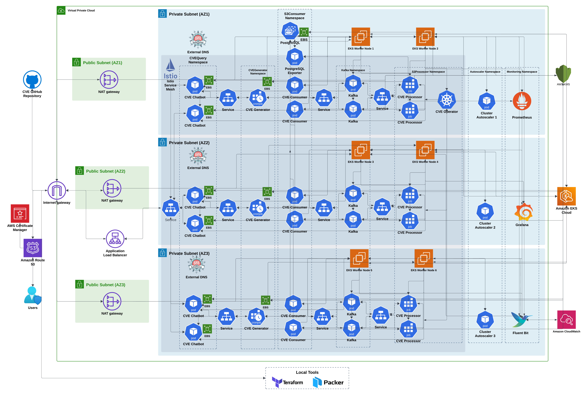

**<h1>CVELens - AI-Powered CVE Pipeline for Real-Time Vulnerability Intelligence</h1>**

## Architecture Diagram

## Introduction
CVELens is an AI-driven web application designed to provide real-time, actionable intelligence on Common Vulnerabilities and Exposures (CVE). With a fully automated pipeline that scales effortlessly and a powerful query interface backed by state-of-the-art machine learning models, CVELens empowers security teams and developers to stay ahead of emerging vulnerabilities. Whether you're a DevOps engineer, security analyst, or software developer, CVELens offers a seamless experience to query the latest vulnerability data and make informed security decisions.

## Table of Contents
- [Overview](#overview)
- [Core Features and Functionality](#core-features-and-functionality)
  - [Automated CVE Monitoring and Processing Pipeline](#1-automated-cve-monitoring-and-processing-pipeline)
  - [AI-Powered Real-Time Querying through Chatbot](#2-ai-powered-real-time-querying-through-chatbot)
  - [Lightning-Fast Query Web App with Minimal Resource Usage](#3-lightning-fast-query-web-app-with-minimal-resource-usage)
  - [Microservice Architecture for AI Indexing](#4-microservice-architecture-for-ai-indexing)
  - [Scalable and Secure Infrastructure](#5-scalable-and-secure-infrastructure)
  - [Comprehensive Monitoring and Logging](#6-comprehensive-monitoring-and-logging)
  - [Managed SSL and DNS](#7-managed-ssl-and-dns)
- [Repositories](#repositories)

## Overview
CVELens automates the entire lifecycle of vulnerability management, from monitoring repositories for new CVEs, processing the data, and streaming it into a Kafka-based pipeline, to providing an AI-powered chatbot for querying and exploring the data. The app is built on Amazon EKS (Elastic Kubernetes Service), leveraging modern cloud-native technologies such as Kubernetes Operators, Kafka, and a microservice architecture that ensures high availability, scalability, and security.

## Core Features and Functionality
### 1. Automated CVE Monitoring and Processing Pipeline
At the heart of CVELens is a custom-built CVE Operator, a custom Kubernetes operator that continuously monitors the official GitHub CVE repository for new vulnerability disclosures. This operator handles the following tasks:
- CRD (Custom Resource Definition) Creation: It deploys CRDs within the Kubernetes cluster to manage the entire CVE lifecycle. These CRDs are responsible for tracking repository changes and managing jobs related to CVE processing.

- Scheduled CVE Monitoring: The operator checks for updates every minute, ensuring real-time detection of new vulnerabilities. If new CVEs are found, the operator automatically initiates a job to download, parse, and enrich the data.

- CVE Parsing and Enrichment: Once the CVE data is downloaded, it undergoes parsing and categorization. The operator enriches the raw data with relevant metadata such as the CVE's severity, affected systems, release date, and remediation details. This enriched data is then prepared for consumption.

- Data Streaming to Kafka: After processing, the enriched CVE data is streamed to a Kafka pipeline. Kafka ensures that data is distributed efficiently across the system, allowing for real-time processing and low-latency data transmission to downstream services.

- Operational Monitoring: The operator keeps track of essential metrics, such as the number of CVEs processed during each run, the timestamp of the last successful run, and additional lifecycle management through Kubernetes finalizers, ensuring no orphaned resources remain.

### 2. AI-Powered Real-Time Querying through Chatbot
The user-facing component of CVELens is an interactive AI-driven chatbot, which provides an intuitive interface for querying vulnerability data. Users can ask complex queries such as:

"Show me vulnerabilities related to the WordPress core and plugins like Wordfence."
"What are the latest critical vulnerabilities affecting Linux kernels?"
The chatbot provides detailed responses, including:
- CVE Record Numbers
- Date of Disclosure and Modifications
- Vulnerability Descriptions
- Affected Versions
- Fix and Mitigation Information

Behind the scenes, the chatbot leverages cutting-edge SentenceTransformers and FAISS (Facebook AI Similarity Search) indexing. The search capability is based on natural language processing (NLP) models, enabling users to query the database in human language and get precise results from the underlying PostgreSQL database. This allows for highly accurate and fast search, even when dealing with large datasets.

### 3. Lightning-Fast Query Web App with Minimal Resource Usage
One of the standout features of CVE-Query is its extreme efficiency and speed. The query web app is optimized to provide detailed CVE information based on user input in no more than a few seconds, even under heavy load. This responsiveness is achieved by optimizing the interaction between the FAISS index and the NLP model, minimizing the need for heavy computational resources.

- Lightweight Resource Consumption: Despite its powerful capabilities, the web app is remarkably light on system resources. It consumes as little as 0.5 GB of RAM and 0.2 vCPU, making it highly efficient for cloud environments or resource-constrained deployments. This ensures the web app can operate smoothly even in autoscaled environments with limited resources.

- Low Latency Responses: The system is designed to deliver low-latency responses to user queries, regardless of the complexity of the search. Users can access detailed CVE data within seconds, providing them with timely information to act upon.

### 4. Microservice Architecture for AI Indexing
The task of generating and maintaining the FAISS index is handled by a dedicated microservice called CVE-Generator. This microservice performs the following:

- Text Embeddings: It uses SentenceTransformers (an LLM model) to convert the textual CVE data into dense vector embeddings, which are then indexed by FAISS. These embeddings capture the semantic meaning of CVE descriptions, ensuring highly relevant search results.

- Indexing and Searching: FAISS is optimized for large-scale search, enabling fast similarity searches even over massive datasets. The microservice regularly updates the index as new CVE data is ingested, ensuring that queries always return the most current information.

### 5. Scalable and Secure Infrastructure
CVELens is designed to handle heavy workloads while maintaining stringent security standards:

#### Dynamic Autoscaling

The application is hosted on an Amazon EKS cluster, which uses a combination of Horizontal Pod Autoscalers (HPA) and a Cluster Autoscaler to scale both pods and nodes based on CPU usage. This ensures that the system can seamlessly handle spikes in data processing or query traffic. The HPA dynamically adjusts the number of running pods based on the resource demands of CVELens, while the Cluster Autoscaler provisions additional nodes when CPU usage surpasses 80%, ensuring uninterrupted performance.

#### Security Best Practices

- Encrypted Data Storage: All persistent data, including EBS volumes, is encrypted using AWS Key Management Service (KMS), safeguarding sensitive CVE data.
- Secure IAM Policies: Access to AWS services is tightly controlled using AWS Identity and Access Management (IAM) policies, ensuring that each component of the application has only the necessary permissions to function.
- NAT Gateways: Outbound traffic from worker nodes is routed through NAT gateways, preventing exposure to the public internet, thus providing an additional layer of security.

### 6. Comprehensive Monitoring and Logging
To ensure the health, performance, and security of the system, CVELens employs an integrated monitoring and logging stack:

#### Monitoring with Prometheus and Grafana:

- The infrastructure is continuously monitored using Prometheus, which collects metrics from various components such as Kubernetes worker nodes, Kafka, Postgres, and the CVE-query web app.
- Dashboards in Grafana provide insights into resource usage, query response times, and other system metrics, helping operators detect performance bottlenecks and make informed scaling decisions.

#### Logging with Fluent Bit and CloudWatch:

- Fluent Bit is used to collect and forward logs from all components, including Kubernetes nodes, Kafka, and the CVE processing pipeline, to AWS CloudWatch. This centralized logging solution allows for real-time log analysis and troubleshooting.
- Additionally, logs related to DNS and SSL management (via ACM and Route 53) are also captured, ensuring visibility into critical external services.

### 7. Managed SSL and DNS
- AWS Certificate Manager (ACM) automates the issuance and renewal of SSL/TLS certificates for the CVE-query web app, ensuring secure HTTPS communication.
- External DNS and Route 53: CVELens automatically manages DNS records through the External DNS Kubernetes controller, ensuring that DNS entries are dynamically created and updated for the CVE-query service. Traffic to the app is load-balanced via an Application Load Balancer (ALB), ensuring high availability and optimized routing.

## Repositories
### 1. [Infra](https://github.com/cvelens/eks-infra-terraform)
This repository contains the Terraform code for provisioning the infrastructure required to deploy the CVELens application on Amazon EKS. It includes the EKS cluster, worker nodes, VPC, subnets, security groups, and other necessary resources.

### 2. [CVE Generator Helm Chart](https://github.com/cvelens/llm-helm-cve-generator)
This repository contains the Helm chart for deploying the CVE Generator microservice on a Kubernetes cluster. The CVE Generator is responsible for generating and maintaining the FAISS index used for querying CVE data using natural language processing (NLP) models.

### 3. [CVE Chatbot Helm Chart](https://github.com/cvelens/llm-helm-cve-chatbot)
This repository contains the Helm chart for deploying the CVE Chatbot microservice on a Kubernetes cluster. The CVE Chatbot provides an interactive interface for querying vulnerability data using natural language queries.

### 4. [CVE Generator Webapp](https://github.com/cvelens/llm-webapp-cve-generator)
This repository contains the code for the CVE Generator web application, which is responsible for generating and maintaining the FAISS index used for querying CVE data using natural language processing (NLP) models.

### 5. [CVE Chatbot Webapp](https://github.com/cvelens/llm-webapp-cve-chatbot)
This repository contains the code for the CVE Chatbot web application, which provides an interactive interface for querying vulnerability data using natural language queries.

### 6. [CVE Operator](https://github.com/cvelens/cve-operator)
This repository contains the code for the CVE Operator, a custom Kubernetes operator that monitors the official GitHub CVE repository for new vulnerability disclosures, processes the data, and streams it into the Kafka pipeline.

### 7. [Jenkins Infra](https://github.com/cvelens/jenkins-infra-terraform)
This repository contains the Terraform code for provisioning the infrastructure required to deploy Jenkins on EC2 instances. Jenkins is used for CI/CD pipelines and automating the deployment of CVELens components.

### 8. [Jenkins Packer](https://github.com/cvelens/jenkins-ami-packer)
This repository contains the Packer template for building a custom Amazon Machine Image (AMI) with Jenkins pre-installed. The AMI is used to launch EC2 instances for running Jenkins pipelines.

### 9. [CVE Processor Helm Chart](https://github.com/cvelens/helm-cve-processor)
This repository contains the Helm chart for deploying the CVE Processor microservice on a Kubernetes cluster. The CVE Processor is responsible for processing the raw CVE data, enriching it with metadata, and streaming it into the Kafka pipeline.

### 10. [CVE Consumer Helm Chart](https://github.com/cvelens/helm-cve-consumer)
This repository contains the Helm chart for deploying the CVE Consumer microservice on a Kubernetes cluster. The CVE Consumer is responsible for receiving the enriched CVE data from the Kafka pipeline and storing it in a PostgreSQL database.

### 11. [CVE Processor Webapp](https://github.com/cvelens/webapp-cve-processor)
This repository contains the code for the CVE Processor web application, which processes the raw CVE data, enriches it with metadata, and streams it into the Kafka pipeline.

### 12. [CVE Consumer Webapp](https://github.com/cvelens/webapp-cve-consumer)   
This repository contains the code for the CVE Consumer web application, which receives the enriched CVE data from the Kafka pipeline and stores it in a PostgreSQL database.

### 13. [Flyway Database Migration](https://github.com/cvelens/flyway-database-migration)
This repository contains the Flyway migration scripts for setting up the PostgreSQL database schema used by the CVE Consumer and Processor web applications.

### 14. [CVE Query Frontend](https://github.com/cvelens/cve-query-frontend)
This repository contains the code for the CVE Query frontend web application, which provides an interactive interface for querying vulnerability data using natural language queries.